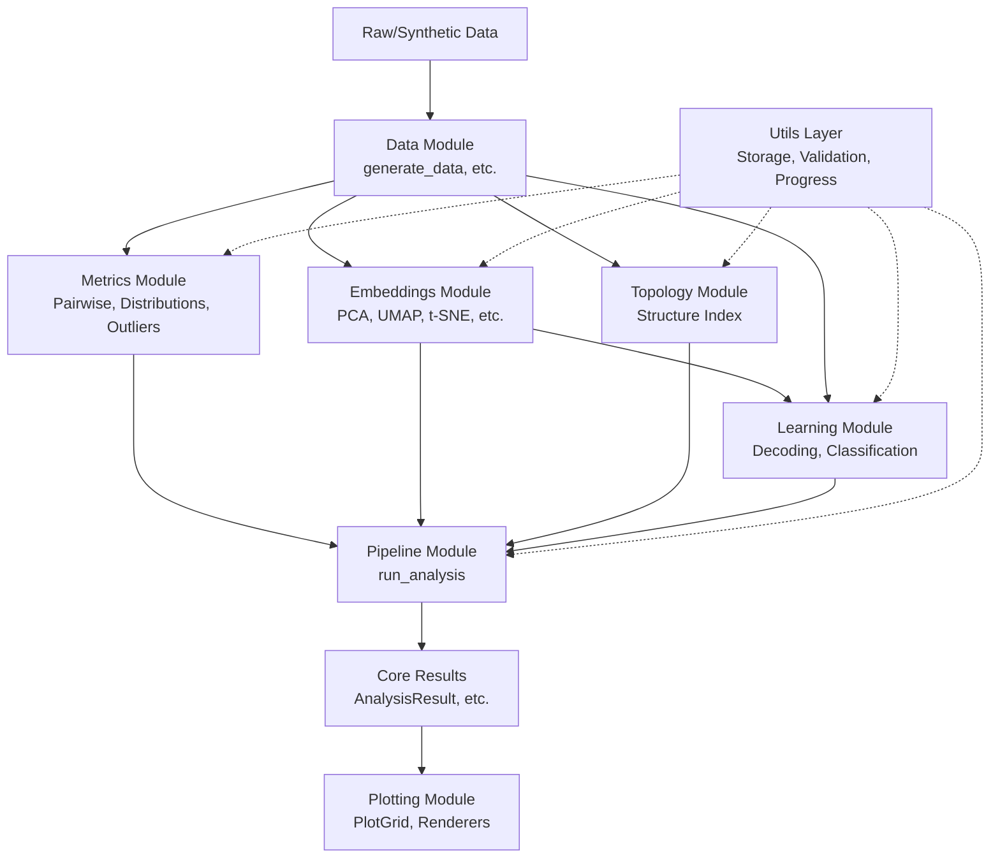

# Analysis Capabilities

The `neural-analysis` repository is a comprehensive toolkit designed to generate, process, measure, embed, and interpret both real and synthetic neural data. Below is a structured overview of what is possible to analyze using this pipeline.

## 1. Synthetic Data Generation and Ground-Truth Testing
Before analyzing complex real-world data, you can build reliable baselines using the `data` module.
- **Simulate Cell Types**: Generate firing rate matrices for idealized Place Cells, Grid Cells, Head Direction Cells, or random background activity.
- **Trajectory Generation**: Create 1D tracks, 2D open fields (random walks), or 3D volumes to simulate the "behavior" underlying the neural activity.
- **Mix and Match**: Combine populations of different cell types to test how robust algorithms are to noisy, heterogeneous data.

## 2. Pairwise Metrics and Geometric Distances
To understand how different neural states relate to one another, the `metrics` module allows you to compute relationships across the population.
- **Standard Pairwise Metrics**: Calculate distance or similarity matrices (Euclidean, Cosine, Pearson correlation) between time bins to see how network activity evolves.
- **Distribution Comparison**: Compare entire populations of activity against each other using statistical metrics like Jensen-Shannon divergence or Wasserstein distances.
- **Outlier Detection**: Filter anomalous activity spikes or dropped frames using built-in outlier detection methods before they corrupt downstream results.

## 3. Dimensionality Reduction (Embeddings)
Neural recordings frequently involve hundreds or thousands of neurons. The `embeddings` module allows you to discover the low-dimensional manifolds that represent the core variables encoded by the network.
- **Linear Methods**: Apply PCA or MDS to find global, linear structures in the variance.
- **Non-Linear Manifold Learning**: Apply algorithms like UMAP, t-SNE, Isomap, or Spectral Embedding to unfold complex non-linear structures (like the "ring" of head direction cells or the "torus" of grid cells).

## 4. Decoding and Machine Learning
You can "read the mind" of the network using the `learning` and `decoding` modules, mapping neural activity back to the variables it represents.
- **Position Decoding**: Use K-Nearest Neighbors (KNN) or Population Vector decoders to predict an animal's location based purely on the firing rates of place cells.
- **Classification**: Train classifiers (Random Forest, SVM) to categorize specific stimuli, brain states, or trial types.
- **Clustering**: Discover unannotated states within the data using unsupervised clustering.

## 5. Topological Data Analysis
The `topology` module focuses on global geometric invariants.
- **Structure Index**: Compute the structure index, which quantitatively measures if a dataset forms a 1D (ring) or 2D (sheet) topological structure, without needing to fully embed it.

## 6. Visualization
Through the `plotting` module and the custom `PlotGrid` system, you can visualize all of the above:
- View raw 3D activity trajectories.
- Plot low-dimensional UMAP or PCA embeddings colored by time, velocity, or decoded position.
- Generate heatmaps of distance matrices.
- Compare classifier performance across epochs using complex statistical plots (violins, box plots) with publication-ready Matplotlib backends or interactive Plotly backends.

## Dataflow

The typical workflow begins with raw or synthetic data, passes through metrics and embeddings, interacts with learning and topology models, and outputs via the plotting framework.

